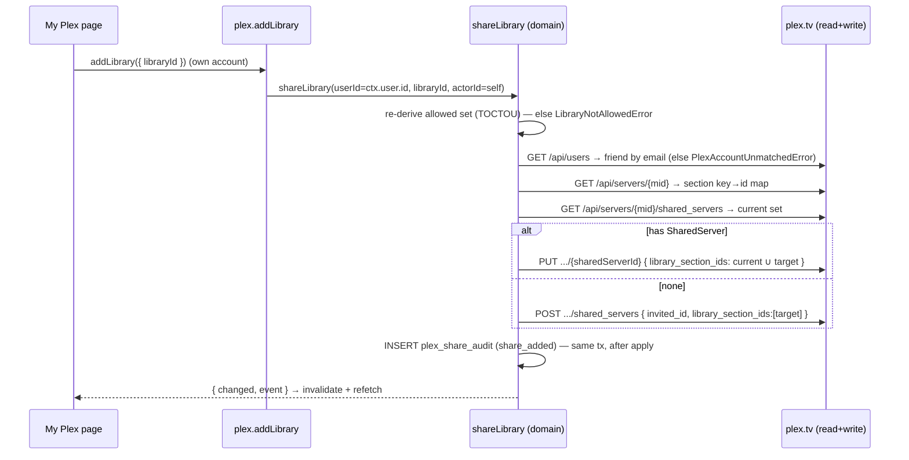

# DESIGN-007: Plex library self-service

- **Status:** Accepted
- **Last updated:** 2026-07-06
- **Amendments:** 2026-07-06 (D-12) — registry `base_url` truthfulness (haynestower is the
  external ingress, no in-cluster Service) + per-server refresh degradation with a summary
  return shape. Live-validated fix on staging v0.6.0 (migration `0011_haynestower_base_url.sql`).
- **Satisfies:** PRD-001 R-25..R-28 (resolves Q-03); governed by ADR-017; supersedes
  DESIGN-001 Appendix A. Builds on ADR-011 (write confinement), ADR-012 (Role model),
  ADR-014 (ConfirmButton), ADR-015 (no reorientation), OPS-002 (topology).

## Overview

Users self-add/remove Plex libraries on their **own** Plex account across the three servers,
limited to the libraries their **Role** allows; admins assign the per-role library set on
`/admin/roles`. The vertical mirrors the Fix/Restore slice end-to-end: `@hnet/db` tables (+
CHECK enums) → `@hnet/domain` single-writers (audit in the same tx) → an injected, read/write-
split, import-confined `@hnet/plex` client → tRPC `plex` router → a `'use client'` page. BC-04
(Plex Sharing) is the enforcement arm — it applies only what BC-02 (the role-derived allowed
set) permits, re-derived inside each mutation (TOCTOU).

**Live topology of record** (OPS-002; verified 2026-07-06, all PMS 1.43.2.10687):

| Slug | Ingress | Backend read URL (default) | machineIdentifier |
|------|---------|----------------------------|-------------------|
| `haynestower` | `plex.haynesnetwork.com` | `https://plex.haynesnetwork.com` ‡ | `a5ec8cb29c425667637eabdb6a0615d6ccf68cc3` |
| `haynesops` | `plexops.haynesnetwork.com` | `http://plexops.media.svc.cluster.local:32400` | `80b33acb1d207508990637ec151fe9abad8d3d7a` |
| `hayneskube` | `k8plex.haynesnetwork.com` | `http://plex.media.svc.cluster.local:32400` | `c1b23d688afea4a39ec2c214776832c16be6504d` |

‡ **haynestower is the EXTERNAL Unraid box — it has NO in-cluster `*.media.svc.cluster.local`
Service** (the original `haynestower.media.svc.cluster.local` default failed DNS from cluster
pods; live defect, 2026-07-06). Cluster pods reach it via its public ingress
`https://plex.haynesnetwork.com` (owner-token verified 2026-07-06). The other two ARE genuine
in-cluster Services. All three remain overridable via `PLEX_<SLUG>_URL`. See D-12.

Note the subdomain↔slug mismatch (plexops↔haynesops, k8plex↔hayneskube): **code uses the
owner SLUGS everywhere**; the subdomains are ingress detail. Observed `GET /library/sections`
`type` values across all three servers: **`movie`, `show`, `artist`, `photo`** — HAYNESTOWER's
family libraries report as `movie` (HNet Home Videos) and `photo` (HNet Photos); Plex has **no**
distinct `homevideo` section type (so `PLEX_MEDIA_TYPES` omits it, contra the plan sketch).

## Detailed design

### D-01 — Schema (`packages/db/src/schema/*`, migration `0010_plex_libraries.sql`)

Four tables; migration 0010 creates them, relaxes the `permission_audit` action CHECK, and
**seeds the three `plex_servers` rows** (infrastructure facts; libraries arrive by refresh —
no grant seeding, per ADR-017).

- **`plex_servers`** — `id` uuid PK (fixed, `SEEDED_PLEX_SERVER_IDS`); `slug` text UNIQUE +
  CHECK (`haynestower|haynesops|hayneskube`); `name`; `base_url` (server-side, **EXEMPT** from
  the R-14/ADR-013 http(s) rule — commented); `machine_identifier`; `token_ref` (env var NAME,
  never the token — CLAUDE.md rule 7); timestamps.
- **`plex_libraries`** — `id` uuid PK; `server_id` → `plex_servers` CASCADE; `section_key` text
  (the Plex section key); `name`; `media_type` text `$type<PlexMediaType>()` + CHECK; `available`
  boolean (soft-state — a vanished library is marked false, never hard-deleted); `synced_at`;
  **UNIQUE(`server_id`, `section_key`)**. **No `is_family_only`** (family = a role grant).
- **`role_library_grants`** — `role_id` → `roles` CASCADE + `plex_library_id` → `plex_libraries`
  CASCADE; composite PK. **Exact mirror of `role_app_grants`.**
- **`plex_share_audit`** — `id`; `user_id` → `users` SET NULL; `plex_library_id` → `plex_libraries`
  SET NULL; `event` text `$type<PlexShareEvent>()` + CHECK; `actor_id` → `users` SET NULL;
  `detail` jsonb; `created_at` (+ indexes). BC-04 owns its own audit (like the BC-03 media
  aggregates — DESIGN-005 D-12); **not** `permission_audit`.

### D-02 — Enums (`packages/db/src/schema/enums.ts`)

```
PLEX_SERVER_SLUGS = ['haynestower','haynesops','hayneskube']   // slug CHECK
PLEX_MEDIA_TYPES  = ['movie','show','artist','photo']          // observed live 2026-07-06
PLEX_SHARE_EVENTS = ['share_added','share_removed']            // plex_share_audit CHECK
```
`PERMISSION_AUDIT_ACTIONS` gains `'update_role_libraries'` (role-grant edits are audited).

### D-03 — `@hnet/plex` (new package; read/write split, import-confined)

Mirrors `@hnet/arr` (`.` / `./read` / `./write`, raw-TS). External Plex models never leak past
its zod schemas (BC-04 ACL).

- `config.ts` — env contract: per server `PLEX_<SLUG>_URL` (default in-cluster DNS) +
  `PLEX_<SLUG>_TOKEN` (**required secret**, never echoed — `assertPlexEnv` copies the
  `assertArrEnv` missing-key pattern); machine identifiers pinned in `PLEX_MACHINE_IDENTIFIERS`
  (overridable via `PLEX_<SLUG>_MACHINE_ID`); `PLEX_TV_BASE_URL = https://plex.tv` (override
  `PLEX_TV_URL` — the e2e stub uses it).
- `xml.ts` — a deliberately minimal, dependency-free XML reader for the flat, attribute-only
  plex.tv v1 responses (no full XML dep; the extracted subset is zod-validated).
- `read.ts` (`@hnet/plex/read`) — `getIdentity`, `listSections` (PMS JSON), and the sharing
  reads: `listFriends`/`findFriendByEmail` (`GET /api/users`), `listServerSections` (`GET
  /api/servers/{mid}` — the section key → plex.tv id map), `listSharedServers`/
  `findSharedServerForUser` (`GET /api/servers/{mid}/shared_servers`).
- `write.ts` (`@hnet/plex/write`) — `createSharedServer` (POST), `updateSharedServer` (PUT),
  `deleteSharedServer` (DELETE). Header comment states it is importable ONLY by
  `packages/domain` + `packages/plex` (the extended arr-write guard enforces it).
- `http.ts` — `X-Plex-Token` header-only (never in URLs), `X-Plex-Client-Identifier`/
  `X-Plex-Product`, GET-only retries; JSON or XML bodies; typed errors (`errors.ts`).

**XML shapes (verified live 2026-07-06):**
- `GET /api/users` → `<MediaContainer><User id email username title>…</MediaContainer>` — email
  match (case-insensitive) yields the Plex account `id` (= the `invited_id`/`userID`).
- `GET /api/servers/{mid}` → `<Server><Section id key title type/>…` — `key` is the server
  section key (registry identity), `id` is the plex.tv section id the share body uses.
- `GET /api/servers/{mid}/shared_servers` → `<SharedServer id userID email allLibraries>
  <Section id key shared/>…</SharedServer>…` — `id` is the `sharedServerId` (PUT/DELETE key);
  the shared base set = the `<Section shared="1">` ids. Real partial shares exist (proving the
  read-merge-write need). POST/PUT body: `{ server_id, shared_server: { library_section_ids,
  invited_id? } }` (JSON; response XML — the python-plexapi friend model).

### D-04 — Domain (`packages/domain/src/*`)

- `effective-allowed-libraries.ts` — `effectiveAllowedLibrariesForUser(userId)`: structural
  mirror of `effectiveAppsForUser`. Admin ⇒ all available libraries; every other user ⇒ their
  role's `role_library_grants` (NO `grants_all` short-circuit — ADR-017 C-03). Only `available`
  libraries are offered.
- `plex-shares.ts` — `shareLibrary`/`unshareLibrary`. (1) re-derive the allowed set and gate
  add with `LibraryNotAllowedError` (TOCTOU, before any Plex call); (2) map user→account
  (`PlexAccountUnmatchedError` if not a friend); (3) read-merge-write (union/subtract against
  the current SharedServer; POST/PUT/DELETE); (4) write the `plex_share_audit` row **after** a
  successful apply — single-shot, since the ledger is append-only and records only applied
  shares (the row's detail carries `previous_section_ids`/`new_section_ids` for the
  preservation proof). Plex failures wrap as `PlexServerUnavailableError` (→ BAD_GATEWAY).
- `plex-registry.ts` — `refreshPlexRegistry({ db, plex, slugs? })`: admin orchestrator; reads
  each server's `GET /library/sections` (+ `/identity`) via the READ client OUTSIDE the tx,
  then upserts `plex_libraries` keyed on `(server_id, section_key)` and marks unseen libraries
  `available=false` in ONE tx (never deletes). `upsertPlexLibraries` is the client-free upsert
  core (also used by the e2e/dev seed, which runs before the stub is up). An unexpected media
  type fails loudly (prompts a `PLEX_MEDIA_TYPES` update) before any write. **Degrades per
  server (D-12):** a typed Plex failure on one server (`PlexError`, incl. the new
  `PlexNetworkError`) is caught + `console.error`-logged (cause preserved, token-free) and
  recorded as `{ ok: false, error }` in the summary; the remaining servers still refresh and
  commit. Returns `{ ok, servers: [{ slug, name, ok, libraryCount?, markedUnavailable?, error? }] }`
  (`ok` = every server ok; `error` is a SHORT label like `'unreachable'`, never a raw message).
- `role-libraries.ts` — `setRoleLibraries({ roleId, libraryIds, actorId })`: replace-whole-set
  (mirrors `updateRole`'s appIds), co-writes an `update_role_libraries` `permission_audit` row.
  Admin role is immutable (implicit all-libraries).
- `plex-clients.ts` — `PlexClientBundle` + `buildPlexClientBundle` + `plexClientBundleFromEnv`
  (mirror `arr-clients.ts`); per-slug read+write clients.
- `errors.ts` — `LibraryNotAllowedError` (FORBIDDEN), `PlexAccountUnmatchedError`
  (UNPROCESSABLE_CONTENT), `PlexServerUnavailableError` (BAD_GATEWAY).

**Share sequence (add):**



Unshare mirrors this: subtract the target; `DELETE .../{sharedServerId}` when the set empties,
else `PUT` the reduced set; audit `share_removed`. Registry refresh: **per server**, external
reads → one upsert tx (upsert seen + `available=false` unseen + update machine id); a per-server
Plex failure is caught and folded into the returned summary (D-12) instead of aborting the rest.

### D-05 — tRPC `plex` router (claims the reserved `plex` name)

- `myLibraries` (authed query) — the caller's allowed libraries grouped per server, each
  annotated `shared` from the read client's live share state; degrades per-server on a Plex
  outage (`available:false`) rather than failing the page.
- `addLibrary` / `removeLibrary` (authed mutations) — own account only (`ctx.user.id`, never a
  `userId` input); role-gated in-domain.
- `refreshRegistry` (admin mutation) — `refreshPlexRegistry` (all or a subset).
- `roleLibraryGrants` (admin query) — libraries grouped by server + grants per role (the matrix).
- `setRoleLibraryGrants` (admin mutation) — `setRoleLibraries`.

New appCodes (two-place edit in `trpc.ts` — `APP_CODED_ERRORS` + the `mapDomainErrors` chain,
per ADR-012 C-10):

| Domain error | appCode | TRPC code |
|---|---|---|
| `LibraryNotAllowedError` | `LIBRARY_NOT_ALLOWED` | FORBIDDEN |
| `PlexAccountUnmatchedError` | `PLEX_ACCOUNT_UNMATCHED` | UNPROCESSABLE_CONTENT |
| `PlexServerUnavailableError` | `PLEX_SERVER_UNAVAILABLE` | BAD_GATEWAY |

### D-06 — UI

- **`/library/plex`** (`'use client'`, top-bar nav "My Plex") — role-allowed libraries grouped
  per server; **Add** is a plain action, **Remove** is the `@hnet/ui` `ConfirmButton` inline
  two-step (ADR-014, never `window.confirm`). Non-permitted libraries are never offered.
- **`/admin/roles`** — a **Refresh Plex libraries** button (admin registry refresh) + a second
  checkbox matrix (`libraryChecklist`, grouped per server) folded into the role editor. Unlike
  the app matrix there is **no "All libraries" master toggle** (`grants_all` ≠ all libraries —
  C-03); unavailable libraries stay checkable so a soft-removed grant round-trips.
- **No layout reorientation** (ADR-015): the action cell reserves a fixed width and the
  ConfirmButton reserves its armed-label width, so arming/removing never reflows neighbors;
  matrix toggles change color/emphasis only. Mutations invalidate-and-refetch. Tokens only
  (no raw hex — CLAUDE.md rule 2).

### D-07 — Ops, e2e, env

- **Env contract** (`.env.example`): `PLEX_<SLUG>_URL` + `PLEX_<SLUG>_TOKEN` (required secret)
  for the three slugs; server URLs are non-secret config. Default backend read URLs: `haynesops`
  / `hayneskube` default to their in-cluster Service DNS; **`haynestower` defaults to its public
  ingress `https://plex.haynesnetwork.com`** — it is the external Unraid box with no in-cluster
  Service (D-12). All three are overridable via `PLEX_<SLUG>_URL`.
- **e2e stub** (`apps/web/e2e/support/stub-plex.ts`) — one `node:http` server stands in for all
  three PMS instances (disambiguated by per-server token) AND plex.tv (disambiguated by
  machineId in the path); stateful shared_servers; `/_stub/calls` + `/_stub/reset`. Wired into
  `harness.ts`/`env.ts` (so `pnpm dev:local` gets it too). The dev/e2e seed populates
  `plex_libraries` + Default/Family grants via `upsertPlexLibraries`/`setRoleLibraries`.

### D-11 — ExternalSecret / secret sourcing (deploy-time; docs only here)

The three owner tokens live in 1Password (`HaynesKube` vault) on the **`homepage`** item as
`HAYNESTOWER_PLEX_API_KEY` / `HAYNESOPS_PLEX_API_KEY` / `HAYNESKUBE_PLEX_API_KEY`. Add three
targeted `data:` remoteRef entries to the haynesnetwork ExternalSecret
(`haynes-ops/.../frontend/haynesnetwork/app/externalsecret.yaml`), mirroring the existing lidarr
remoteRef pattern:

| secretKey (env var) | 1Password item → property |
|---|---|
| `PLEX_HAYNESTOWER_TOKEN` | `homepage` → `HAYNESTOWER_PLEX_API_KEY` |
| `PLEX_HAYNESOPS_TOKEN` | `homepage` → `HAYNESOPS_PLEX_API_KEY` |
| `PLEX_HAYNESKUBE_TOKEN` | `homepage` → `HAYNESKUBE_PLEX_API_KEY` |

**Never** source these from the 1Password `plexops` item — its similarly-named key is a
different credential (documented collision, OPS-002). No bulk `homepage` extract. **Deploy-time
observation:** the live `homepage-secret` in-cluster exposes the HAYNESOPS token under the key
`HOMEPAGE_VAR_PLEXOPS_API_KEY` (homepage's own var name), not `HAYNESOPS_PLEX_API_KEY` — confirm
the exact 1Password property name for the haynesnetwork ExternalSecret remoteRef before rollout.
The tokens carry account-owner (sharing) scope — the homepage widgets only need read scope, so
verify owner scope against a live write with the designated test user.

### D-12 — Registry `base_url` truthfulness + per-server refresh resilience (live-validated 2026-07-06)

Two defects surfaced when the registry refresh was first exercised on staging v0.6.0; both are
fixed here without changing the BC-04 contract.

1. **haynestower reachability.** The 0010 seed + `PLEX_CLUSTER_URL_DEFAULTS` pinned haynestower's
   `base_url` to `http://haynestower.media.svc.cluster.local:32400` — a Service that **does not
   exist** (haynestower is the external Unraid box; only `haynesops`/`hayneskube` are in-cluster
   PMS Services). Cluster pods reach haynestower via its public ingress
   `https://plex.haynesnetwork.com` (owner-token verified 2026-07-06). Fix: correct the default
   (`packages/plex/src/config.ts`) **and** the seeded row (migration `0011_haynestower_base_url.sql`
   — registry metadata must stay truthful). Still overridable via `PLEX_HAYNESTOWER_URL`.

2. **Untyped network failures + all-or-nothing refresh.** A DNS/connection failure inside
   `@hnet/plex`'s http layer escaped as undici's raw `TypeError: fetch failed` (not a
   `PlexError`), so `refreshPlexRegistry` re-threw it and the whole request 500'd with a leaked
   bare message — even though the alphabetically-earlier servers had already refreshed and
   committed in their own transactions, and nothing indicated *which* server failed. Fixes:
   - `PlexNetworkError` (`packages/plex/src/errors.ts`) — the http wrapper now wraps any non-HTTP,
     non-abort `fetchImpl` rejection into this typed `PlexError` subclass (host named, token never
     echoed, original as `cause`), mirroring `PlexTimeoutError`. GET-retry-on-transient still
     applies (network errors are retryable for idempotent GETs).
   - `refreshPlexRegistry` **degrades per server**: it catches `PlexError` per server,
     `console.error`-logs the cause (a failed refresh was previously invisible in pod logs), and
     records `{ ok: false, error }` with a SHORT label (`'unreachable'`, `'timed out'`, `HTTP n`,
     `'unexpected response'`) — never a raw message. It returns
     `{ ok, servers: [{ slug, name, ok, libraryCount?, markedUnavailable?, error? }] }`. An
     unexpected media type still throws (loud — needs a code change, not a transient outage).
   - `plex.refreshRegistry` returns the summary (partial failure is a 200 summary, not a throw);
     `mapDomainErrors` still maps genuinely fatal cases (config missing, unexpected media type).
   - `/admin/roles` renders the per-server outcome after a refresh in a `.status-note` region
     (info tone when all ok, `--warn` warning tone when partial — e.g. "HaynesKube: 1 library ·
     HaynesOps: 1 library · HaynesTower: unreachable"). It is **not** the red `.alert` banner;
     ADR-015 discipline holds (status renders in the page's consistent feedback area).

## Alternatives considered

See ADR-017 "Considered options": per-user/per-tag grants (rejected — ADR-012), an
`is_family_only` deny flag (rejected — family is a role grant), the v2 API (rejected — 405
live), blind overwrite (rejected — revokes other shares).

## Test strategy

- **Unit (vitest, embedded PG16):** `effectiveAllowedLibrariesForUser` (Admin ⇒ all; role ⇒ its
  grants; Family includes the family libs, Default excludes them; grants_all ⇒ still explicit);
  `shareLibrary`/`unshareLibrary` (role gate throws with NO write-client call; read-merge-write
  preserves pre-existing sections; audit row same-tx; create/update/delete selection; idempotent
  no-op); `setRoleLibraries` (replace-set + audit; Admin immutable); `refreshPlexRegistry`
  (upsert keyed on `(server, section_key)`; same-named `Movies` on two servers stays distinct;
  soft-unavailable + re-available; loud on unexpected type). `@hnet/plex`: the XML parser + read
  (friend/section/shared parsing; token header-only) + write (POST/PUT/DELETE bodies) + config.
- **Guard tests:** the four tables join `no-direct-state-writes`; `@hnet/plex/write` joins the
  write-import guard.
- **API:** admin refresh populates the registry; matrix + `setRoleLibraryGrants` drive grants;
  member add/remove records the stub write and myLibraries reflects it; `LIBRARY_NOT_ALLOWED` /
  `PLEX_ACCOUNT_UNMATCHED` flow through the real errorFormatter; the authed/admin ladder.
- **e2e (hermetic, stub-plex):** member sees role-allowed libraries (family withheld); add
  records a sharing write; remove via ConfirmButton records the un-share; narrow-viewport fit;
  admin refresh + the library matrix reflecting seeded grants.
- **LIVE (deferred):** as a designated Plex test-user, add a permitted library and confirm the
  share on the real server; remove it; confirm a non-permitted (family) library is not offered.

## Open questions

| ID | Question | Resolution |
|----|----------|------------|
| Q-06 | Who is the owner-designated Plex test-user for live write validation, and should there be an invite/friend-creation flow + a registry-refresh CronJob? | (open — owner action; writes deferred to that user; no invite flow / no CronJob shipped now) |
