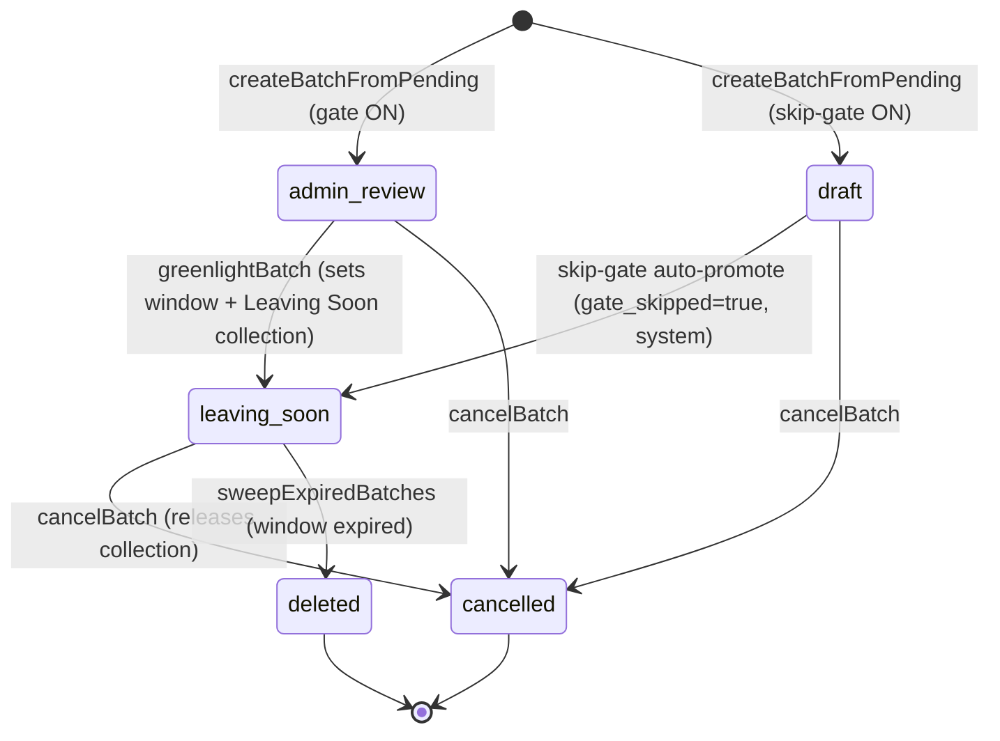
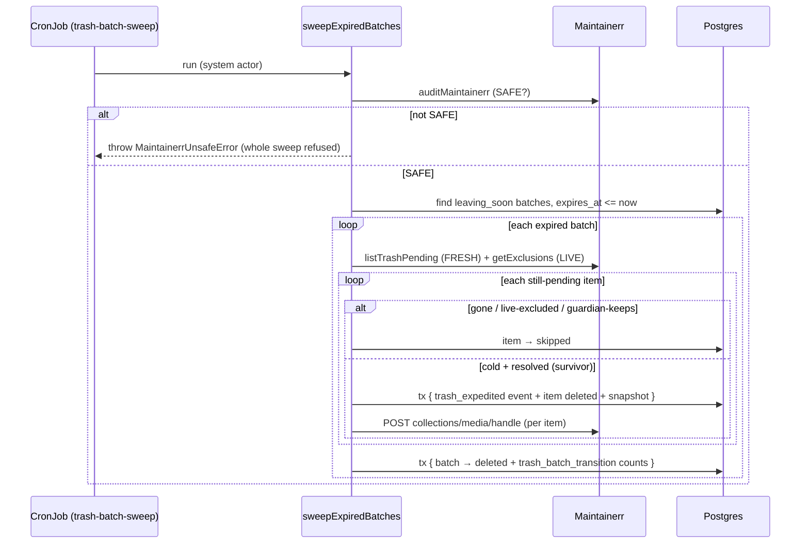

# DESIGN-011: Trash curation pipeline — state machine, Leaving Soon, sweep, and wire contracts

- **Status:** Accepted
- **Date:** 2026-07-07
- **Author:** Fable 5 (autonomous run, PLAN-012)
- **Implements:** ADR-025 (curation pipeline). Extends DESIGN-010 (Trash/Maintainerr — D-02 REST
  mapping, D-05 guardian, D-08 wire contracts). Relates ADR-014/015 (confirm + no-reorient),
  ADR-019 (poster proxy).

This design is the contract the **Trash curation UX** wires against. The backend vertical (schema,
domain, API, sweep) shipped first; the poster-wall UX (D-07, implemented 2026-07-07) landed as the
follow-up change on the same branch.

---

## D-01 — The batch state machine (ADR-025 C-01)



**Invariants.** Only `leaving_soon` expires; it is reached ONLY by `greenlightBatch` OR the audited
skip-gate path. Every transition is a guarded `UPDATE … WHERE state = <from>` (a lost race →
`TrashBatchStateError`/CONFLICT) with a `trash_batch_transition` ledger event in the SAME tx. At most
one OPEN (`draft|admin_review|leaving_soon`) batch per media kind (partial unique index).

### Transition table

| From → To | Trigger (domain) | Actor gate | Audit written (same-tx) | External Maintainerr write (protective-first) |
|---|---|---|---|---|
| — → `admin_review` | `createBatchFromPending` (gate on) | `manage_batches` | `trash_batch_transition` `{to:'admin_review',itemCount}` | none |
| — → `draft` → `leaving_soon` | `createBatchFromPending` (skip-gate on) | `manage_batches` (system-attributed promote) | two events; second `{gateSkipped:true}` | create Leaving Soon collection |
| `admin_review` → `leaving_soon` | `greenlightBatch` | `manage_batches` | `trash_batch_transition` `{windowDays,expiresAt,collectionId}` | create Leaving Soon collection |
| open → `cancelled` | `cancelBatch` | `manage_batches` | `trash_batch_transition` `{to:'cancelled'}` | `removeCollection` (if any) |
| `leaving_soon` → `deleted` | `sweepExpiredBatches` | system / `manage_batches` (Expire now) | per-item `trash_expedited` + batch `trash_batch_transition` `{counts}` | per-item `collections/media/handle` |
| item `pending` ⇄ `saved` | `setBatchItemSaved` | `admin_review`⇒`manage_batches`; `leaving_soon`⇒`save_leaving_soon` | `trash_batch_saves` + `trash_excluded` | `addExclusion`/`removeExclusion` + collection `remove`/`add` |

> **Errata (2026-07-08, owner-directed) — GLOBAL SAVE IS A SUPERSET OF THE WINDOWED RESCUE.**
> Holding `save_exclude` (the anytime whitelist power, relabelled **“Save items — anytime (whitelists
> any flagged item)”**) now IMPLIES `save_leaving_soon` (relabelled **“Save items — during a
> Leaving-Soon window only”**) everywhere the latter gates — the `leaving_soon`⇒`save_leaving_soon`
> row above passes for a `save_exclude` holder too. If you can whitelist any flagged item at any time,
> you can obviously rescue one that is Leaving Soon. The implication is **one-directional** (a
> `save_leaving_soon`-only holder gains NO anytime pending-wall save) and **computed, never written**
> to `role_trash_action_grants` (stored grants are untouched). It lives in `hasTrashAction` /
> `effectiveTrashActions` (`packages/api/src/middleware/role.ts`); the `/trash` page hands the client
> the same expanded set so the family rescue wall lights up for global-Save holders. In the role
> editor's Trash grid, checking “Save items — anytime” renders the rescue row checked + disabled with
> an *“included in Save”* note (unchecking restores its stored value). Admin still implies all actions.

---

## D-02 — Data model (migration 0017)

- **`trash_batches`** — `id`, `media_kind` (`movie|tv` CHECK), `state` (CHECK), `window_days`,
  `gate_skipped`, `greenlit_at`/`by`, `expires_at`, `maintainerr_collection_id`, `created_at`/`by`,
  `cancelled_at`, `deleted_at`. Partial unique index `one_open_per_kind`.
- **`trash_batch_items`** — `id`, `batch_id` (FK cascade), `maintainerr_media_id`, `collection_id`,
  `media_item_id` (nullable FK), snapshots `title/year/tmdb_id/tvdb_id/size_bytes/poster_source`,
  `state` (`pending|saved|deleted|skipped|protected` CHECK), `saved_by`/`saved_at`, `deleted_at`, +
  **deletion snapshot** `deleted_size_bytes/deleted_resolution/deleted_imdb_rating/deleted_tmdb_rating`
  (D-06). Unique `(batch_id, maintainerr_media_id)`.
- **`trash_batch_saves`** — `id`, `batch_item_id` (FK cascade), `user_id`, `action` (`save|unsave`
  CHECK), `created_at`. The tuning dataset (Q-07).
- **`app_settings`** — `key` PK (CHECK from `APP_SETTING_KEYS`), `value` jsonb, `updated_at`,
  `updated_by`. All four tables are on the `no-direct-state-writes` guard list.

---

## D-03 — Leaving Soon collection mechanics (ADR-025 C-04; Q-05 verified from source)

Re-verified against Maintainerr **v3.17.0** on **2026-07-07** (`Maintainerr/Maintainerr@v3.17.0`,
`apps/server/src/modules/collections/collections.controller.ts` — `createCollectionBodySchema` /
`collectionBaseShape`; `collection-worker.service.ts`; `@maintainerr/contracts`
`collections/servarr-action.ts` + `media-server/enums.ts`). The confined write methods live in
`@hnet/arr/write` (`MaintainerrWriteClient`). **The pre-2026-07-07 row was wrong on three points**
(numeric `type`, `arrAction:0`, `deleteAfterDays:null` — all corrected below); it never worked
against a live v3.17.0.

| Purpose | Method (base `/api`) | Body | Notes |
|---|---|---|---|
| Create Leaving Soon | `POST /collections` | `{ collection: { title, libraryId, type:'movie'\|'show', isActive:true, arrAction:4, manualCollection:false, visibleOnHome:true, visibleOnRecommended:true }, media:[{mediaServerId}] }` | **Returns NO body (void, HTTP 201)** — re-read the new id via `GET /collections` matching the exact `title` (idempotent: reuse if one already exists). `type` is `z.enum(MediaItemTypes)` — the STRING `'movie'`/`'show'` (a numeric code is **rejected 400**). `arrAction:4` = `ServarrAction.DO_NOTHING` — the collection worker's **ONLY** per-collection skip; any other value ages the collection. `visibleOn*` pushed to Plex Home+Recommended by `updateCollectionVisibility`. |
| Add rescued-back items | `POST /collections/add` | `{ collectionId, media:[{mediaServerId}], manual:true }` | un-save re-adds |
| Remove rescued items | `POST /collections/remove` | `{ collectionId, media:[{mediaServerId}] }` | save pulls out |
| Tear down | `POST /collections/removeCollection` | `{ collectionId }` | cancel |

`libraryId` is derived at green-light from the batch items' source rule collection (via
`GET /collections`). `type` = `'movie'` (movie) / `'show'` (tv). **We do NOT send `deleteAfterDays`:
it is `z.coerce.number().int().optional()`, so `null` coerces to `0` (`Number(null)`) — every member
would be instantly past its danger date, and with any `arrAction` other than DO_NOTHING the
estate-wide worker would delete the WHOLE collection on its next run. `arrAction:4` is the only lever
that stops aging.** The write is external-first (ADR-023 C-05); the pending derivation
(`fetchMaintainerrPending`) skips collections whose title is a Leaving-Soon name so our own manual
collections never re-enter the pending set nor mis-target the sweep's per-item handle.

---

## D-04 — The expiry sweep sequence (ADR-025 C-05)



Intent-first: the event + terminal state + snapshot commit BEFORE the per-item handle; a failed
handle is tolerated per-item (intent durable, Maintainerr reconciles) and never aborts the batch.

---

## D-05 — Wire contracts (tRPC `trash.batches.*` + `trash.settings.*`)

The UX agent wires against these. All compose the ADR-023 gates; errors ride `mapDomainErrors`
(`TRASH_BATCH_STATE`/`TRASH_BATCH_ALREADY_OPEN` → CONFLICT; `TRASH_BATCH_EMPTY` →
UNPROCESSABLE_CONTENT; `TRASH_SAVE_NOT_OWNED` → FORBIDDEN; `MAINTAINERR_UNSAFE` →
PRECONDITION_FAILED).

```ts
// ---- reads (section read_only) ----
trash.batches.list        // in: { mediaKind?: 'movie'|'tv' } | undefined
// out: BatchSummary[]  — { id, mediaKind, state, windowDays, gateSkipped, greenlitAt, expiresAt,
//                          createdAt, deletedAt, cancelledAt,
//                          counts: { pending, saved, deleted, skipped, protected, total },
//                          reclaimedBytes }   (timestamps ISO strings)

trash.batches.get         // in: { batchId: uuid }
// out: BatchSummary & { items: BatchDetailItem[] }
//   BatchDetailItem = { id, maintainerrMediaId, mediaItemId, collectionId, title, year, tmdbId,
//                       tvdbId, sizeBytes, posterSource, state, savedBy, savedAt, posterUrl,
//                       imdbRating, tmdbRating, recentlyWatched }
//   posterUrl: the ADR-019 authed proxy url (null when unresolved) — the poster-wall tile source.
//   imdbRating/tmdbRating/recentlyWatched (added by the D-07 UX pass, 2026-07-07): a read-only
//   media_metadata join for the tile caption rating and the "watched ⇒ guardian keeps it" eye
//   overlay; recentlyWatched uses the same RECENTLY_WATCHED_WINDOW_DAYS window the sweep's
//   guardian applies, so the wall's eye matches what expiry will actually protect. Live reads —
//   NOT part of the frozen creation snapshot.

trash.batches.saveStats   // in: { batchId: uuid }
// out: { batchId, totalSaves, totalUnsaves, netSaved,
//        byUser: [{ userId, displayName, saves, unsaves }] }
// NET, not raw event counts (repeatedly save/un-saving a title must NOT inflate the tallies):
//   saves   = items CURRENTLY 'saved' (grouped by saved_by) — the SAME source as counts.saved + the
//             wall; unsaves = items rescued-then-released (state<>'saved', last audit event an un-save,
//             credited to the last releaser). The two sets are disjoint; netSaved == totalSaves.
//   trash_batch_saves is the untouched audit/tuning DATASET behind this — never the count.

// ---- lifecycle (trashActionProcedure('manage_batches') — admin ⇒ ok) ----
trash.batches.create      // in: { mediaKind: 'movie'|'tv' }
// out: { batchId, state, mediaKind, itemCount, gateSkipped, expiresAt }

trash.batches.greenlight  // in: { batchId: uuid, windowDays?: 1..365 }
// out: { state:'leaving_soon', expiresAt, windowDays, collectionId }

trash.batches.cancel      // in: { batchId: uuid }               -> { state:'cancelled' }
trash.batches.expire      // in: { batchId: uuid }  (manual "Expire now")
// out: SweepReport = { batchesSwept, batches: [{ batchId, mediaKind, deletedCount, skippedCount,
//                       savedCount, protectedCount, handleErrors,
//                       raceSkipped,   // F2: items Saved mid-sweep (guarded write lost the race)
//                       aborted }] }   // F3: circuit breaker tripped ⇒ batch left leaving_soon to resume

// ---- per-item save (PHASE-dependent gate: read_only + action check in-resolver) ----
trash.batches.setItemSaved // in: { batchId: uuid, itemId: uuid, saved: boolean }
// gate: admin_review ⇒ manage_batches; leaving_soon ⇒ save_leaving_soon (else FORBIDDEN)
// UN-SAVE OWNERSHIP (server-authoritative, enforced in the setBatchItemSaved writer — NOT UI-only):
//   during the OPEN leaving_soon window an un-save is owner-or-manager only — a bare
//   `save_leaving_soon` holder may release ONLY their own rescue (saved_by === caller); releasing
//   another family member's rescue needs `manage_batches`/admin, else TRASH_SAVE_NOT_OWNED (FORBIDDEN).
//   The API passes `callerCanManage = hasTrashAction(role, 'manage_batches')` (admin ⇒ true) down to
//   the writer. admin_review un-saves are already manage_batches-gated, so the manager rules there are
//   unchanged. (Save, and un-saving your own, are unaffected.)
// out: { changed: boolean, state: TrashBatchItemState }
//   On an ACTIVE flip: changed:true, state 'saved' (save) | 'pending' (un-save). On an INERT flip
//   (redundant save, or the item is already 'protected'/'skipped'/'deleted'): changed:false and
//   state is the item's ACTUAL current state — so callers must accept the full item-state union.

// ---- settings (adminProcedure) ----
trash.settings.get         // -> { trash_skip_admin_gate: boolean, trash_default_window_days: number }
trash.settings.set         // in: { trashSkipAdminGate?: boolean, trashDefaultWindowDays?: 1..365 }
//                            -> the updated settings map
```

---

## D-06 — Deletion snapshot schema (Q-08)

Written same-tx as `state='deleted'` at sweep time (PLAN-013's metrics source):
`deleted_size_bytes` (bigint), `deleted_resolution` (media_metadata tier), `deleted_imdb_rating`,
`deleted_tmdb_rating` (numeric). Title/tmdb/tvdb ride the creation snapshot; media type = the batch's
`media_kind`. `listBatches`/`getBatchDetail` expose `reclaimedBytes = Σ deleted_size_bytes`.

---

## D-07 — Poster-wall UX (implemented 2026-07-07 — the `/trash?tab=batches` area; ADR-014/015)

Ships as a **Batches tab** on `/trash` (alongside Movies · TV · Recently Deleted · Rules ·
Activity), with a Movies|TV segmented switch inside it (batches never mix kinds) and deep-linkable
`?tab=batches&kind=&batch=` state. Layout order is phone-first: lifecycle strip → countdown →
running counts → **the wall** → save-stats → history → settings.

- **Poster wall** (`apps/web/app/(app)/trash/batches-tab.tsx`; pure rules in
  `apps/web/lib/trash-batches.ts`, unit-tested) — the /library poster-grid density (fixed 2:3
  boxes, 3-up at 390px). Each tile: poster, single-line title/year caption, size + ★rating meta,
  and a **fixed-corner overlay badge**: **X** (pending — outlined danger), **lock** (saved —
  filled accent, the deliberate "deepens color" flip), **eye** (pending but recently watched —
  the guardian will keep it, so an X would be dishonest; inert), **shield** (protected — inert),
  **⊘** (skipped — kept-not-saved, ADR-023 C-07b), **trash** (deleted; poster grays out).
  **Tap toggles X ⇄ lock in place** — optimistic flip, reconciled with the `setItemSaved`
  response; on `changed:false` the tile renders the RETURNED real state. The badge re-mount pop
  is transform-only; captions are fixed-height — the tile never moves/reflows (hard rule 9). No
  per-tap confirm (protective + reversible).
- **Running counts header** — sticky, fixed-height, tabular figures, derived from the SAME glyph
  mapping as the tiles: `Deleting N · Rescued M · Kept K · frees X GB` (terminal batches switch
  to `Deleted/freed` off the deletion snapshots).
- **Batch actions** — **Green-light** ⇒ Modal (what promotes, the window-days input defaulting
  from `trash_default_window_days`, the rolling Plex collection name + Home visibility, what the
  sweep does after). **Cancel** ⇒ `ConfirmButton` two-step. **Expire now** ⇒ DANGER Modal:
  honest "up to N delete / saved untouched / at least K skipped" preview, enabled only once the
  window has closed (mirrors the server precondition), post-run report from `SweepReport` incl.
  `raceSkipped` ("saved mid-run") and the `aborted` banner ("batch not finished — it will
  resume"). **Create batch** stays clickable while a batch is open — the server refusal names
  the blocking batch (id + state) inline.
- **Phase-aware permissions** (mirrors the D-05 setItemSaved gate): `admin_review` ⇒ only
  `manage_batches` holders tap; `leaving_soon` ⇒ `save_leaving_soon` holders while the window is
  open — they may lock anything and **unlock only their own locks** (this is now enforced
  server-side — a bare `save_leaving_soon` holder un-saving a foreign lock gets
  `TRASH_SAVE_NOT_OWNED`/FORBIDDEN; the wall scopes the family flow to own locks to match. A manager
  (`manage_batches`/admin) can always release a foreign lock, shown as "saved by <name>"). Everyone
  else sees the wall read-only.
- **User (Leaving Soon) view** — same wall + the countdown banner ("These delete in N days — tap
  the ✕ on anything you want to keep"); no lifecycle buttons; calm read-only after expiry.
- **Save-stats** — a "Who rescued what" list under the wall (`saveStats.byUser` — the PLAN-014
  tuning record, surfaced lightly). NET counts: a saver's tally is their current effect (save→unsave→
  save = 1; save→unsave = 0; a tug-of-war lands on the final holder), never a raw flip count.
- **Admin settings** — a Trash-settings card (admin-only — `trash.settings.*` is
  adminProcedure): skip-gate flip via two-step ConfirmButton with the
  straight-to-Leaving-Soon explanation, default window days; flips are `update_app_setting`-
  audited.
  > **Amended by ADR-032 (2026-07-07 / DESIGN-004 D-16):** the card moved off the Batches
  > tab to **`/settings/trash`** (user-menu "Trash settings"). Controls, testids, gates,
  > and audit are unchanged.
- In-theme stroke-drawn glyphs per DESIGN-006 (no borrowed icon set); wall screenshots captured
  for owner approval (owner memory: visual identity sign-off).

> **Amended by ADR-033 (2026-07-07 evening, owner-directed):** the **Batches tab is folded into
> the per-kind Movies/TV tabs** — one open batch per kind is the enforced invariant, so a batch is
> a *property* of the kind, not a separate browsable collection. `apps/web/app/(app)/trash/batches-tab.tsx`
> is replaced by **`kind-tab.tsx`** (`KindTab`), a state-aware surface the Movies/TV tab renders
> off `trash.batches.list` scoped to the kind:
> - **no open batch** → the live-candidates pending wall (passed in as a render prop) + an
>   admin-only **"Start a batch"** header; terminal batches collapse into a **Past-batches** strip
>   (`<details>` rows that expand to each batch's final report — the terminal PosterWall).
> - **admin_review** → the batch wall (curation) + the lifecycle header (Green-light / Cancel) +
>   an admin-only **"new candidates since this batch (K)"** strip (client-side diff of the live
>   pending set vs the batch's media ids — eligible for the next batch).
> - **leaving_soon** → countdown + family save wall + "Who rescued what" + Expire-now (window-close
>   gated) + the same new-candidates strip.
> - **terminal** → back to the pending wall + the Past-batches strip.
>
> All wire calls are unchanged (zero backend change). The kind-switch seg control, the `?kind=` /
> `?batch=` params, and the empty-state card are retired; `?tab=batches` redirects to the per-kind
> tab (kind rides along). The wall glyph language is **unified** with the pending wall
> (`trash · shield · check · eye · skip · gone`; `wallGlyph` renames X→`trash`, lock→`shield`,
> protected→`check`) and every tile gains a corner **library-nav link** (`?from=trash-*`).
> **The Expire report now defers the batch-list refetch to modal close** — a successful sweep flips
> the batch terminal, which would otherwise unmount the LifecycleView (and its Modal) before the
> report is read; deferring keeps the Deletion report on screen until dismissed.

---

## D-08 — Ops (env + CronJob)

- **No new secrets.** The sweep drives Maintainerr with the existing `MAINTAINERR_URL` /
  `MAINTAINERR_API_KEY` (shipped with PLAN-006). The write client is built inside `@hnet/domain`
  (`maintainerrClientBundleFromEnv`) so `@hnet/arr/write` stays import-confined (ADR-008).
- **CronJob (haynes-ops, next to the sync jobs):** `tsx sync.ts --mode=trash-batch-sweep` — **hourly**
  at deploy. No `--source` (it drives Maintainerr, not an *arr). Needs `DATABASE_URL` +
  `MAINTAINERR_URL`/`MAINTAINERR_API_KEY`. Exit 1 (retry) when the sweep refuses on an unsafe install.
  Manual-first: the job can ship disabled and be enabled once the first cycle is validated.
- The sweep writes NO `sync_runs` row — its audit trail is `trash_batch_transition` + `trash_expedited`
  ledger events + the batch columns (richer than a sync row; consistent with expedite).

### Deploy-time checklist

1. Migration 0017 runs (migrator initContainer) — four tables + five CHECK rebuilds.
2. Add the hourly `trash-batch-sweep` CronJob manifest under
   `kubernetes/main/apps/frontend/haynesnetwork/` (mirror the existing sync CronJobs; add the
   Maintainerr env from the existing External Secret).
3. Grant `save_leaving_soon` / `manage_batches` to the intended roles via `/admin/roles` (not seeded).
4. Optionally set `trash_default_window_days` via `trash.settings.set`; leave `trash_skip_admin_gate`
   OFF until PLAN-014's graduation criteria.
