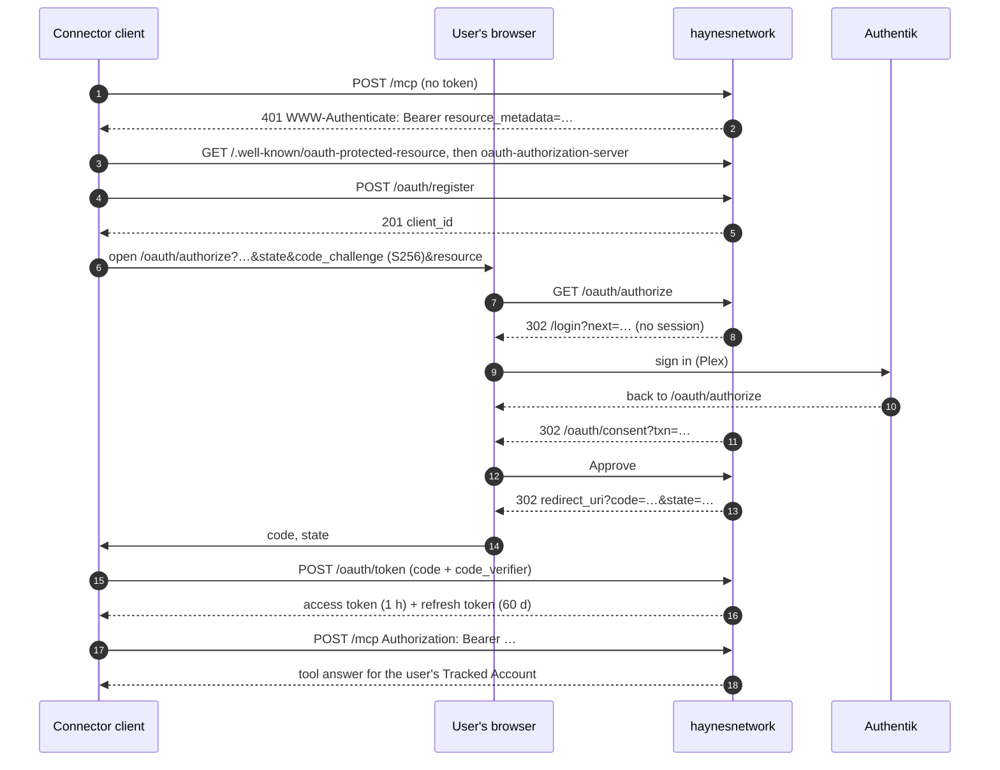

# FLOW-001: Connecting an AI app to the watch tools — authorize, sign in, consent, token, first `/mcp` call

- **Status:** Draft
- **Actors:** the user (the owner, or since the 2026-09-23 ruling any signed-in household member); a
  connector client (ChatGPT, Claude Code or Codex; claude.ai unverified, DESIGN-050 Q-01); the app
  (haynesnetwork: its authorization server and the public `/mcp`); Authentik (sign-in only).
- **Satisfies:** PRD-001 US-14, R-247..R-251, AC-25..AC-28
- **Realizes:** ADR-091; DESIGN-050 D-02..D-09 and D-14 (copy). Terms: DDD-001 T-254..T-259.

## Trigger

The user adds `https://haynesnetwork.com/mcp` as a connector (a remote MCP server) in their client, or
the client's tokens are gone (disconnected, family revoked, refresh expired) and it must authorize again.

## Steps

1. **Discovery.** The client calls `POST /mcp` without a token. The app answers **401** with
   `WWW-Authenticate: Bearer resource_metadata="https://haynesnetwork.com/.well-known/oauth-protected-resource"`.
   The client reads the protected-resource metadata (`resource` is `https://haynesnetwork.com/mcp`, the
   only authorization server is `https://haynesnetwork.com`), then the authorization-server metadata
   (DESIGN-050 D-02). ChatGPT caches this document, which is why the paths never change (ADR-091 C-12).
2. **Registration.** The client posts its metadata to `/oauth/register` (a name, 1 to 5 redirect URIs,
   auth method `none`, both grants). The app validates it (D-04), stores an **OAuth Client** (T-255) and
   answers **201** with a `client_id`. Log: `client_registered`. ChatGPT registers once per connector
   (redirect `https://chatgpt.com/connector/oauth/<id>`) and reuses that client for every later
   authorization; Claude Code and Codex register loopback redirects (D-12).
3. **Authorization request.** The client makes a PKCE verifier and its S256 challenge and a `state`, and
   opens the user's browser at `/oauth/authorize` with `response_type=code`, `client_id`,
   `redirect_uri`, `scope` (or none, meaning all three), `state`, `code_challenge`,
   `code_challenge_method=S256` and usually `resource=https://haynesnetwork.com/mcp`. The app checks the
   client and the redirect URI first (exact match; a loopback redirect matches with the port ignored),
   then the parameters (D-05 steps 1–2). Log: `authorize_started`.
4. **Session gate.** Without an app session the app redirects to
   `/login?next=<the authorize path and query>`. The user presses the usual sign-in button and signs
   in through Authentik (with Plex); Better Auth returns the browser to `next`, which re-enters step 3
   (D-09). A user who is already signed in skips this step. There is no owner gate: any signed-in user continues (ADR-091 C-04).
5. **Authorization Transaction.** The app stores an **Authorization Transaction** (T-256; 10 minutes)
   holding the validated request and redirects to `/oauth/consent?txn=<uuid>`.
6. **Consent.** The consent page re-derives the signed-in user and checks the transaction (a well-formed
   UUID, unexpired, this user's own). It shows **Connect \<client name\>**, the host the browser will be
   sent back to, one line per requested scope, and **Approve** / **Deny**, each with its decision bound
   into the server action. Consent is never remembered. Log: `consent_shown`.
7. **Approve.** One transaction (`grantConsent`): delete the Authorization Transaction (re-checking its
   expiry), store a single-use authorization code (60 seconds), write the `oauth_consent_granted` audit
   row. The browser is redirected to `redirect_uri?code=…&state=…`. Log: `consent_granted`.
8. **Code exchange.** The client checks `state` and posts a form to `/oauth/token` with
   `grant_type=authorization_code`, the code, `redirect_uri`, `code_verifier`, `client_id` and usually
   `resource`. The app checks the client, the code's expiry, the redirect URI, the S256 verifier (in
   constant time) and the resource, consumes the code atomically, and issues an access token (1 hour)
   and, when `offline_access` was granted, a refresh token (60 days) that starts a new **Refresh
   Family** (T-257). Response
   `{access_token, token_type: "Bearer", expires_in: 3600, scope, refresh_token}` with
   `Cache-Control: no-store`. The same call prunes expired rows (D-03). Log: `token_issued`.
9. **First `/mcp` call.** The client posts `initialize`, `tools/list` and `tools/call` to `/mcp` with
   `Authorization: Bearer <access token>`. The app looks the **Delegated Token** (T-258) up by its hash
   (not revoked, not expired, bound to the canonical resource) and builds the consumer
   `oauth:<client_id>` with the token's scopes; `tools/list` is filtered by scope. The principal is the
   token user's **Tracked Account** (T-259): `users.id` → the ADR-053 Plex Account Map → a
   `watch_accounts` row with `tracked = true`. The tools answer for that account, under the same
   64 KB cap, 9 s deadline and Voice Budget as the hop (DESIGN-049). No `Mcp-Session-Id` is issued. Log:
   `[mcp] tool_called` with `"consumer":"oauth:<client_id>"`; `last_used_at` is stamped on the token and
   the client at most once a minute.
10. **Refresh.** When the access token expires (or earlier), the client posts
    `grant_type=refresh_token`. A conditional update rotates the refresh token (race-safe across the
    three replicas) and issues a new pair in the same family; a refresh may narrow scopes. Log:
    `token_refreshed`.
11. **Disconnect or revoke (end of the lifecycle).** The user opens **Connected apps**, presses
    **Disconnect** and then **Confirm disconnect**: one transaction revokes every family and token that
    app holds for this user and writes `oauth_client_disconnected`; the app's next `/mcp` call answers
    401 and it must start again at step 3 (ChatGPT reuses its `client_id`). A client may also call
    `/oauth/revoke` itself (ChatGPT does on reconnect): a refresh token or a family access token revokes
    the family, and the answer is always 200. Log: `token_revoked`.

## Failure paths

| Step  | Condition                                                                                                                                                                 | What happens                                                                                                                                                      | Log                      |
| ----- | ------------------------------------------------------------------------------------------------------------------------------------------------------------------------- | ----------------------------------------------------------------------------------------------------------------------------------------------------------------- | ------------------------ |
| 2     | Invalid registration metadata (name empty or over 80 characters, no or more than 5 redirect URIs, a non-`https` non-loopback URI, an unknown grant, auth method or scope) | RFC 7591 error body (`invalid_client_metadata` or `invalid_redirect_uri`); nothing stored                                                                         | —                        |
| 2     | More than 10 registrations in an hour from one client IP                                                                                                                  | Refused                                                                                                                                                           | `rate_limited`           |
| 3     | **Unknown client or redirect URI** (not registered; a loopback URI with a different path, query or fragment)                                                              | The **bad request** page; the app never redirects to an unverified URI                                                                                            | `authorize_rejected`     |
| 3     | **Missing PKCE** (`code_challenge` absent, or `code_challenge_method` not `S256`; `plain` is refused)                                                                     | Redirect to the verified `redirect_uri` with `error=invalid_request` and `error_description`                                                                      | `authorize_rejected`     |
| 3     | **Missing `state`**                                                                                                                                                       | The same `invalid_request` redirect, with no `state` to echo; the client discards the response                                                                    | `authorize_rejected`     |
| 3     | Other parameter errors: `response_type` not `code`, a scope outside the three (`invalid_scope`), `resource` not the canonical one (`invalid_target`)                      | Redirect with `error`, `error_description` and `state`                                                                                                            | `authorize_rejected`     |
| 3     | More than 30 authorization requests a minute from one client IP                                                                                                           | Refused                                                                                                                                                           | `rate_limited`           |
| 4     | Sign-in fails at Authentik or is abandoned                                                                                                                                | The existing `/login` error states; the authorization request is lost, and the user starts again from the app                                                     | —                        |
| 6     | **Expired transaction** (older than 10 minutes), a malformed `txn`, or another user's transaction                                                                         | The **expired request** page; nothing is issued. Approve re-checks expiry when it writes, so a page left open past 10 minutes also lands here                     | —                        |
| 7     | The user presses **Deny**                                                                                                                                                 | `oauth_consent_denied` audit row; redirect with `error=access_denied` and `state`                                                                                 | `consent_denied`         |
| 8     | **Code replay** (a consumed code presented again)                                                                                                                         | `invalid_grant`                                                                                                                                                   | `code_replayed`          |
| 8     | Code expired (60 seconds), wrong client, redirect URI or verifier mismatch, resource mismatch                                                                             | Refused with an RFC 6749 error (`invalid_grant`); the client starts again at step 3                                                                               | —                        |
| 8, 10 | A JSON body instead of a form                                                                                                                                             | 400 `invalid_request`                                                                                                                                             | —                        |
| 8, 10 | More than 60 token requests a minute from one client IP                                                                                                                   | Refused                                                                                                                                                           | `rate_limited`           |
| 10    | **Refresh reuse** (a rotated or revoked refresh token presented again)                                                                                                    | The whole family is revoked (refresh and access rows) with an audit row, and the answer is `invalid_grant`; the client must authorize again. The Loki alert fires | `refresh_reuse_detected` |
| 10    | A refresh token presented by a different client                                                                                                                           | `invalid_grant`                                                                                                                                                   | —                        |
| 9     | No, unknown, expired or revoked access token                                                                                                                              | 401 with the `resource_metadata` challenge; the client refreshes (step 10) or authorizes again                                                                    | —                        |
| 9     | A token bound to another resource                                                                                                                                         | 401 with the challenge                                                                                                                                            | `audience_mismatch`      |
| 9     | The hop token sent to `/mcp`                                                                                                                                              | 401: `/mcp` knows only Delegated Tokens                                                                                                                           | —                        |
| 9     | A tool outside the token's scopes                                                                                                                                         | 403 `WWW-Authenticate: Bearer error="insufficient_scope", resource_metadata="…"`                                                                                  | —                        |
| 9     | GET, DELETE or any method but POST                                                                                                                                        | 405 (the empty-stream GET is the fallback if a client stalls on it, ADR-091 C-13)                                                                                 | —                        |
| 9     | A body over 64 KB, a JSON-RPC batch, a call past 9 s                                                                                                                      | 413, refused, deadline answer, as on `/api/mcp` (DESIGN-049)                                                                                                      | —                        |
| 9     | The user's account is gone (user deleted)                                                                                                                                 | Tokens cascade away; 401                                                                                                                                          | —                        |

**Not failures** (the connection is fine and the tool answers normally):

- **Untracked account.** The user has no Plex Account Map row, or the mapped account is not a tracked
  `watch_accounts` row (today everyone but the Server Owner, until PLAN-070): every tool answers
  "Watch history isn't set up for your account yet." Never an auth error.
- **Non-owner mark.** A tracked account that is not the Server Owner's: `mark_watched` records the mark
  in history only (`plex_result = 'none'`) and answers "Noted \<title\> as watched in your history. Only
  the server owner's marks change Plex." An undo of such a mark makes no Plex call either.
- **No history yet.** The existing "Watch history isn't ready yet." when the `watch` sync has never
  succeeded (OPS-015 §6).

## UI states

Copy is normative in DESIGN-050 D-14.

| Surface            | State                                                                                                                                                                    | Shown when                                   |
| ------------------ | ------------------------------------------------------------------------------------------------------------------------------------------------------------------------ | -------------------------------------------- |
| `/login`           | the existing sign-in page and its error states                                                                                                                           | step 4, no session                           |
| `/oauth/consent`   | **Connect \<client name\>**: the lead line, "Sends you back to \<redirect host\>.", one line per scope, **Approve** and **Deny**                                         | step 6                                       |
| `/oauth/consent`   | **This request expired** ("Start the connection again from \<client name\>." or "from your app")                                                                         | an expired, malformed or foreign transaction |
| `/oauth/authorize` | **Something is off with this connection request**                                                                                                                        | an unknown client or redirect URI            |
| the client         | its own connected state (after the redirect in step 7) or its own error (after a redirect with `error`)                                                                  | steps 7–8                                    |
| Connected apps     | the list: one row per app with name, redirect host, "Connected \<date\>", "Last used \<date\>" or "Never used", scope chips (Read history, Mark titles, Stays connected) | the user has a connected app                 |
| Connected apps     | "No connected apps yet."                                                                                                                                                 | none                                         |
| Connected apps     | **Disconnect** → armed **Confirm disconnect** → **Disconnected** (in place, no reflow)                                                                                   | step 11                                      |
| tool answers       | "Watch history isn't set up for your account yet." / the non-owner mark answer / "Watch history isn't ready yet."                                                        | step 9, as above                             |
